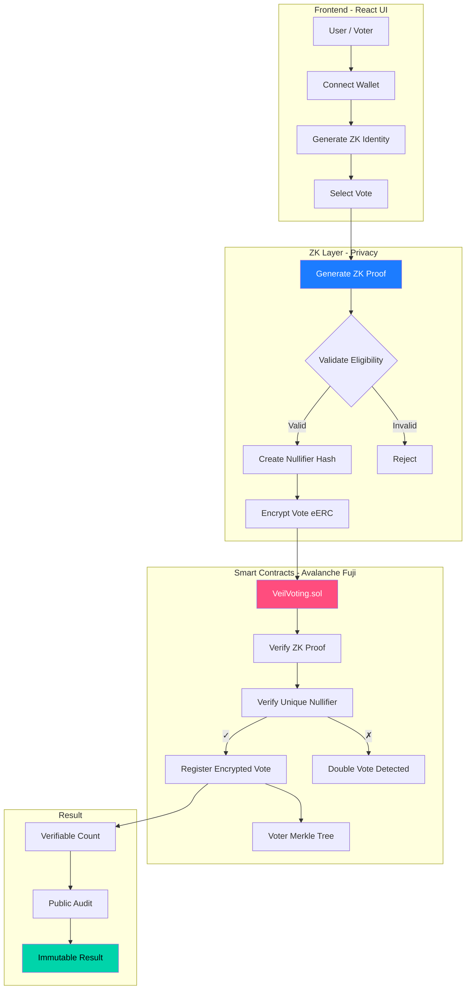
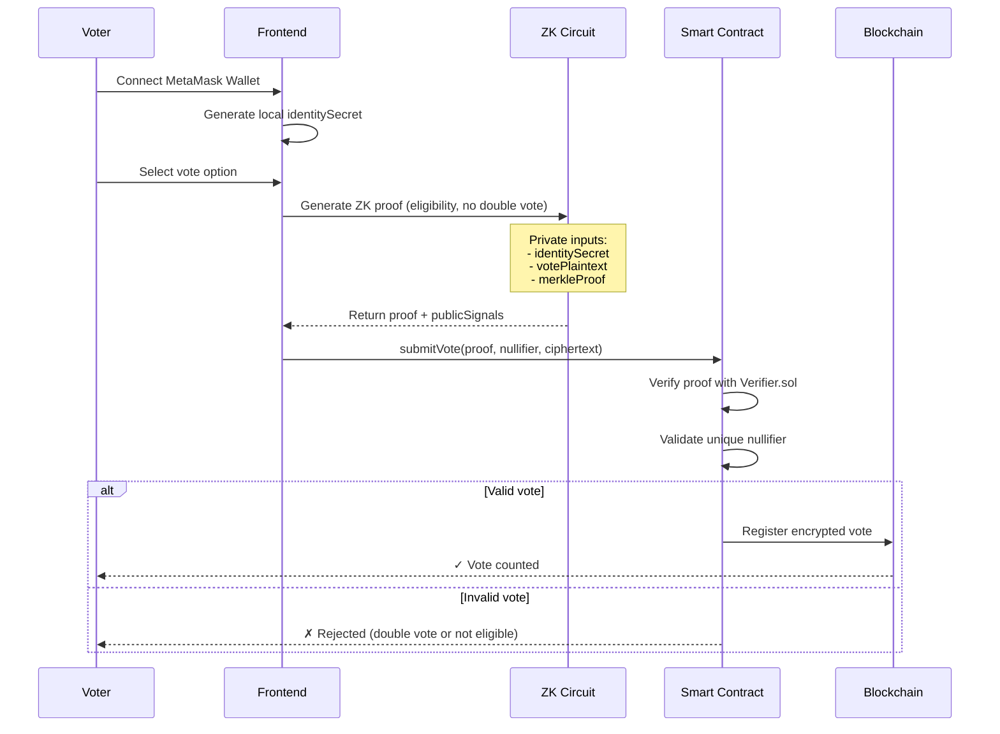

# ARG25 Project Submission

Welcome to Invisible Garden - ARG25.

Each participant or team will maintain this README throughout the program.  
You'll update your progress weekly **in the same PR**, so mentors and reviewers can track your journey end-to-end.

## 🧊 Project Title
**Glacier - Anonymous Voting System on Avalanche**

## Team
- Team/Individual Name: **DevCristobalvc**
- GitHub Handles: [@DevCristobalvc](https://github.com/DevCristobalvc)
- Devfolio Handles: [@DevCristobalvc](https://devfolio.co/@DevCristobalvc)

## Project Description

**Glacier** is an anonymous and verifiable voting system built on Avalanche that uses **encrypted tokens (eERC)** and **Zero-Knowledge Proofs (ZK-SNARKs)** to guarantee vote privacy while maintaining electoral process transparency.

### 🎯 The Problem
Electoral corruption and vote manipulation is one of the most serious problems facing Latin America. Lack of transparency, vote buying, and voter intimidation are common practices that weaken democracy. Traditional systems don't guarantee:
- **Real vote privacy** (they can be traced)
- **Independent verifiability** (you depend on centralized authorities)
- **Coercion resistance** (no way to prove your vote without exposing it)

### 💡 The Solution
Glacier allows citizens to vote in a way that is:
- **Anonymous**: Your identity is never associated with your vote on-chain
- **Verifiable**: Anyone can audit that only eligible voters participated
- **Coercion-resistant**: Impossible to prove how you voted without revealing your private key
- **Transparent**: The entire process is auditable on blockchain

### 🏗️ Technical Architecture

### 🔐 Vote Flow

## Tech Stack

### Blockchain
- **Avalanche C-Chain** (Fuji Testnet)
- **Solidity** (Smart contracts)
- **Foundry** (Testing & deployment)

### Zero-Knowledge
- **Circom** (Circuito ZK)
- **SnarkJS** (Proof generation)
- **Groth16** (Proving system)

### Frontend
- **React + TypeScript**
- **Vite** (Build tool)
- **Ethers.js** (Blockchain interaction)
- **MetaMask** (Wallet integration)

### Encryption
- **AES-256** (Voto local)
- **Poseidon Hash** (ZK-friendly)

## Objectives

### Week 1 (Oct 24-31)
- ✅ Define technical architecture
- ⏳ Implement base contracts (VeilVoting.sol, Verifier.sol)
- ⏳ Create basic ZK circuit for vote validation

### Week 2 (Nov 1-7)
- Integrate ZK proof generation in frontend
- Deploy to Fuji testnet
- Avalanche-style UI/UX (blue/red palette)

### Week 3 (Nov 8-14)
- End-to-end testing
- Complete technical documentation
- Demo video showing anonymous voting flow

## Weekly Progress

### Week 1 (ends Oct 31)
**Goals:**
- Establish system architecture
- Setup monorepo (contracts/ + zk-circuits/ + frontend/)
- Implement basic VeilVoting contract
- Create Circom circuit for eligibility validation

**Progress Summary:**  
_Will be updated at the end of the week..._

### Week 2 (ends Nov 7)
**Goals:**  
- Integrate Circom with React frontend
- Deploy to Avalanche Fuji testnet
- Implement UI for generating and submitting votes
- Test gas costs and proof generation time
 
**Progress Summary:**  
_Will be updated at the end of the week..._

### 🗓️ Week 3 (ends Nov 14)
**Goals:**  
- Complete testing of vote → verification → count flow
- Optimize UX (loading states, error handling)
- Technical documentation and whitepaper
- Demo video + final presentation

**Progress Summary:**  
_Will be updated at the end of the week..._

## Final Wrap-Up
_After Week 3, summarize your final state: deliverables, repo links, and outcomes._

- **Main Repository Link:** [Pending]
- **Demo / Deployment Link (if any):** [Pending]
- **Slides / Presentation (if any):** [Pending]

## 🧾 Learnings
_What did you learn or improve during ARG25?_

- Practical implementation of ZK-SNARKs in voting systems
- Gas cost optimization on Avalanche C-Chain
- Design of coercion-resistant and double-vote-proof systems
- Integration of Circom + Solidity + React

## Next Steps
_If you plan to continue development beyond ARG25, what's next?_

- **Scalability**: Implement proof aggregation (batch verification)
- **Decentralized tallying**: Mixnet system to decrypt results without central authority
- **Multi-chain**: Expand to other chains (Polygon, Arbitrum)
- **Real use cases**: Pilots with civil organizations in LATAM
- **Security audit**: Hire specialized ZK audit firm

---

## 🌎 Social Impact

**Glacier is not just technology, it's a tool to restore trust in Latin American democracy.**

Use cases:
- 🗳️ Transparent municipal elections
- 🏛️ Civil organization voting
- 🎓 University student elections
- 🏢 Anonymous corporate decisions

_This template is part of the [ARG25 Projects Repository](https://github.com/invisible-garden/arg25-projects)._  
_Update this file weekly by committing and pushing to your fork, then raising a PR at the end of each week._
